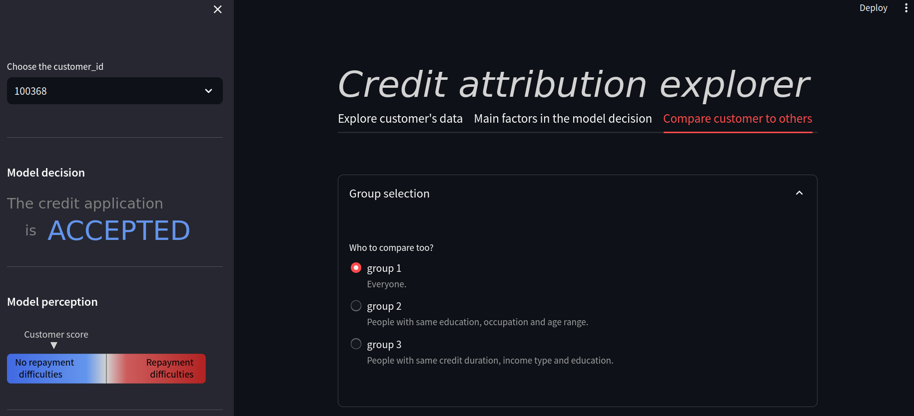

# Adopt a MLops cycle to build and deploy a model of credit scoring

Raw data can be found [here](https://www.kaggle.com/c/home-credit-default-risk/data).
___
**Main goals of this project**:
- Opt for a Kaggle kernel to process raw data.
- Test and track performances of different models while ensuring reproducibility.
- Include techniques to handle the class imbalance and improve performances.
- Implement and deploy an API to infer credit scores from the cloud with a CI/CD pipeline.
- Implement and deploy a dashboard to help customer relations managers in explaining the model decisions (for transparency).
____
## Feature engineering

Apply the script of this [GitHub repository](https://github.com/js-aguiar/home-credit-default-competition/blob/master/README.md) on raw data to obtain the pickle file I used to train my models on.

The resulting dataset is to be saved to this path:  './pickle_files/features.pkl.gz'. 

In this [exploratory notebook](https://nbviewer.org/github/JulienfLeBoucher/OC_MLOps_credit_scoring/blob/main/quick_EDA_of_Kaggle_Aguiar_feature_engineering.ipynb#toc0_), one can understand how I discovered the raw data content and have a glance at the results of the feature engineering.

## Approach to build a model to predict one customer's credit score.

I basically chose to prepare a subset of the processed data to feed several types of classifiers and organize an hyperparameters search for each of them in order to find the most performant.

The hyperparameter search was made with hyperopt, using a cross-validation scheme, and optimizing a custom metric discussed [here](https://github.com/JulienfLeBoucher/OC_MLOps_credit_scoring/blob/main/report.md). 

Note that each performance measurement include a post-training threshold moving to optimize its value.

The subdirectory *hyperparameter_tuning* is the MLproject which ensures the reproducibility of this search. 2 classes of algorithms best-performed - lightgbm classifiers and random forest classifiers.

*random_forest* and *lightgbm* are the two subsequent MLprojects made to fine-tune the models with more data and iterations.

These MLprojects call functions and classes implemented in *project_tools*. 

This [notebook](https://nbviewer.org/github/JulienfLeBoucher/OC_MLOps_credit_scoring/blob/main/classifiers_exploration/building_classifiers.ipynb) helped a lot in designing those tools and can be a nice support to understand the steps/ideas I went through while making this project.

This [notebook](https://nbviewer.org/github/JulienfLeBoucher/OC_MLOps_credit_scoring/blob/main/explore_mlflow_tracking.ipynb) was mainly used to explore MLflow experiments trackings and pick the best models.


# API

In the *api* subdirectory, there are:
- the core of the API: a flask application where I define the endpoints actions. 
- utility functions.
- tests designed with unittest.
- a [notebook](https://nbviewer.org/github/JulienfLeBoucher/OC_MLOps_credit_scoring/blob/main/api/api_dev.ipynb) made to develop and test while developing the API.
- a serialized model for demonstration purpose (because I had no time to make my local MLflow model registry accessible from the cloud.)
- a reduced dataset of clients' features.
- a directory to save shap images before encoding them.
___

To run the API locally on port 8000 :

```shell
export FLASK_APP=my_app.py
flask run --host=localhost --port=8000
```
___

The API is able to respond:
- information about the model used for inference.
- an encoded image of the global interpretability of the model.
- a sample of clients' data (to be used in the dashboard when comparing one client to others.)

- when specified a customer_id:
    - information about the client's credit score and the class it belongs to.
    - an encoded image of the local interpretability of the model for the client.
____

Note that, when someone pushes a modification to the github *api* subdirectory in the main branch, the following [workflow](https://github.com/JulienfLeBoucher/OC_MLOps_credit_scoring/blob/main/.github/workflows/build_test_and_deploy_API.yml) is triggered. It runs the tests of the *api* directory before connecting via ssh to the EC2 instance to reload the upgraded API if all tests were passed.
___
## Dashboard


The *dashboard* subdirectory contains:
- the dashboard application made with streamlit.
- visual elements defined in svg or css.
- utility functions and a class called group which helps in comparing (and plotting) a client with people of the same kind according certain criterions.
- a small [user scenario](https://github.com/JulienfLeBoucher/OC_MLOps_credit_scoring/blob/main/dashboard/user_scenario.md).
- a [notebook](https://nbviewer.org/github/JulienfLeBoucher/OC_MLOps_credit_scoring/blob/main/dashboard/dashboard_dev.ipynb) where I developed some tools for the dashboard.

___

To run the dashboard and ensure its connection to the API, you have to define the API_ROOT environment variable first.

```shell
export API_ROOT=http://localhost:8000
streamlit run dashboard.py
```
___

The dashboard is made of 3 tabs, which interacts with the customer_id:
- to explore one customer's data;
- to get model explainability;
- to compare one customer to some others.


When selecting a customer_id, the class and a visual representation of the model perception is displayed in the left sidebar and the 3 tabs adapt.


In the first tab, one can display a selection of features of interest.


The second tab let you observe global and local explainability of the model returned with the shap library:


Finally, the last tab is a comparison zone. First, you can choose the kind of customers you want to compare too.



Then you can compare the selected customer value to the group distribution for each feature.


and also in a bivariate manner:


___


